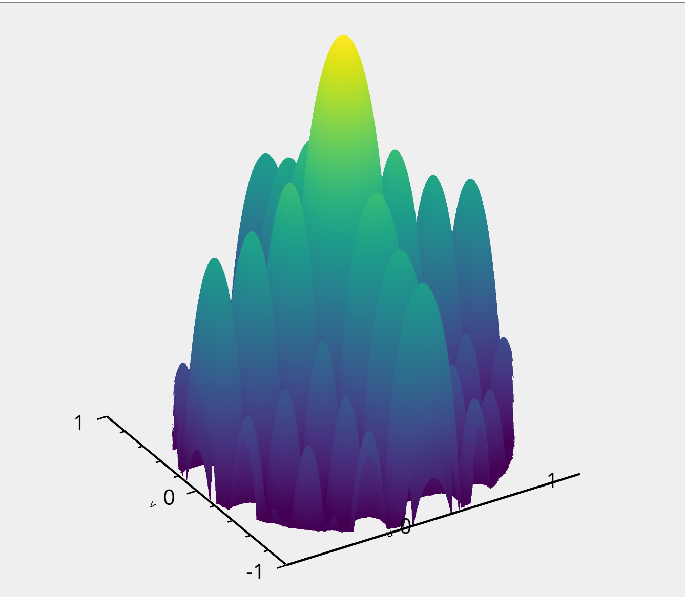

This is the Phased Array Project.
=================================

Python utilities for working with phased array radars.

This is a hobby project for getting familiar with phased array radar beamforming.

## Install


Install the normal way:

```bash
pip install phased_array
```

## Basic usage

An example that creates a ULA and plots the array factor with Vispy.

You must have a Vispy backend installed to see this; e.g. `pip install pyqt6` 
```python
import vispy.plot as vp
import phased_array
import numpy as np

# spacing between elements
d = 0.05
# number of elements
n = 8
# wavelength
λ = 0.1
# pointing azimuth angle
az = 30
# create a uniform linear array
arr = phased_array.PhasedArray.ula(d, n)
# generate complex weights for pointing at az
weights = arr.weights_at_azel(λ, az, 0)
# sample array factor from -90 to +90.
x = np.linspace(-90, 90, 300)
θ = np.radians(x)
ϕ = np.zeros_like(θ)
af = arr.array_factor(λ, weights, θ, ϕ)

fig = vp.Fig()
plot = fig[0, 0]
af_db = 20 * np.log10(np.abs(af))
af_db -= np.max(af_db)
print("HERE")
plot.plot(
    (x, af_db),
    marker_size=0.0,
    color="blue",
    width=2.0,
    xlabel="Angle (°)",
    ylabel="Array Factor (dB)",
)
print("THERE")
plot.camera.set_range(y=[-40, 0])
print("AHHHHH")

fig.show(run=True)
```

For a planar array example, see the [notebook](./notebooks/array.ipynb)


